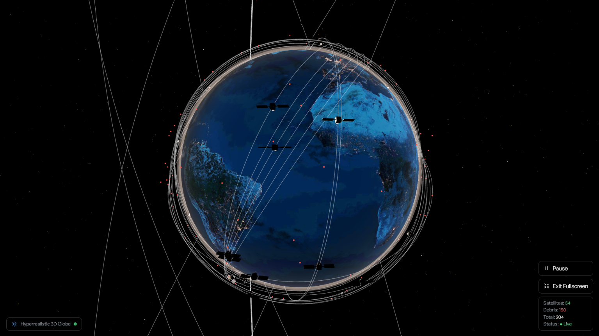

# Nabh-Rakshak — Space Situational Awareness & Collision Risk Dashboard

> **See the Orbit. Predict the Threat. Protect the Mission.**


Nabh-Rakshak is a web-based **Space Situational Awareness (SSA)** platform designed to track satellites and space debris, predict potential close-approach events, and present collision risks through an intuitive visual dashboard.

The platform combines **live orbital data, SGP4-based propagation, conjunction screening, risk scoring, 3D visualization, alerts, and space-weather information** in a single unified interface.

---

Nabh-Rakshak follows a simple data pipeline:

```text
TLE / OMM Data Ingestion
        ↓
   Orbit Propagation
        ↓
 Conjunction Detection
        ↓
Risk Scoring & Assessment
        ↓
   ┌────┴────┐
   ▼         ▼
3D Orbit   Alerts &
Visualization  Analytics
```

Users can track orbital objects, explore trajectories, detect conjunctions, compare approaching objects, understand collision risk, monitor space-weather conditions, and review historical risk data — all from one dashboard.

---

## Key Features

### Live Orbital Tracking
- Ingest publicly available TLE/OMM orbital data from CelesTrak and ISRO catalogs
- Track satellites, payloads, and space debris objects in real-time
- Display interactive orbital elements and telemetry on an interactive 3D globe

### Orbital Propagation
- Propagate satellite states into the future using high-precision SGP4 models
- Generate predicted orbital trajectories over a configurable time window

### Conjunction Detection
- Compare predicted positions between orbital objects
- Detect close approaches within configurable thresholds
- Estimate time and distance of closest approach (TCA and Miss Distance)

### Collision Risk Scoring
- Convert conjunction parameters into an intuitive risk score
- Categorize threats by severity level (Critical, Warning, Low) and prioritize events

### 3D Space Visualization
- Interactive Earth-centered orbital visualization built with Three.js
- Orbit-path rendering with highlighted high-risk objects and debris clouds
- Interactive object inspection with high-fidelity telemetry modals

### Risk Alerts
- Dedicated high-risk conjunction monitoring panel
- Time-to-close-approach countdowns and closest-approach distance metrics
- Object pair identification and risk-level prioritization

### Space Weather Insights
- Real-time solar activity, X-ray flux, and geomagnetic Kp-index condition data
- Environmental space-weather context alongside orbital analysis

### Risk History & Analytics
- Per-object risk history and conjunction analytics powered by Chart.js
- Dashboard-level orbital statistics and historical trend visualization

---

## Technical Architecture

```text
                         ┌──────────────────────────┐
                         │       Web Dashboard      │
                         │ React + TypeScript       │
                         │ Three.js + Chart.js      │
                         └────────────┬─────────────┘
                                      │
                                      ▼
                         ┌──────────────────────────┐
                         │       REST API           │
                         │ Flask Backend            │
                         └────────────┬─────────────┘
                                      │
                    ┌─────────────────┼─────────────────┐
                    ▼                 ▼                 ▼
          ┌────────────────┐ ┌────────────────┐ ┌────────────────┐
          │ Orbital Data   │ │ Space Weather  │ │ Local / Cache  │
          │ Space-Track    │ │ NOAA SWPC      │ │ Telemetry Data │
          │ CelesTrak      │ │                │ │ Alert History  │
          └───────┬────────┘ └────────────────┘ └────────────────┘
                  │
                  ▼
        ┌─────────────────────────┐
        │     Application Layer   │
        │ Orbit Propagation       │
        │ Conjunction Engine      │
        │ Risk Assessment         │
        │ Analytics Engine        │
        └────────────┬────────────┘
                     │
                     ▼
          ┌────────────────────────┐
          │ Dashboard Intelligence │
          │ 3D Visualization       │
          │ Risk Alerts            │
          │ Analytics              │
          └────────────────────────┘
```

---

## Technology Stack

**Frontend:** React 18, TypeScript, Vite, Tailwind CSS, Three.js, Chart.js (`react-chartjs-2`), Framer Motion, Lucide React, React Router (`HashRouter`)

**Backend:** Python 3, Flask, Flask-CORS, REST APIs

**Orbital Computation:** SGP4 propagation, TLE/OMM parsing, relative-position and closest-approach calculations, conjunction screening

**Data Sources:** Space-Track orbital catalog, CelesTrak orbital data, ISRO Satellite telemetries, NOAA Space Weather Prediction Center (SWPC) data

**Data Storage:** Satellite/object records, conjunction events, risk history, analytics cache

---

## System Workflow

1. **Data Ingestion** — TLE/OMM data is fetched, validated, normalized, and cached in the object catalog.
2. **Orbit Propagation** — Orbital elements are propagated with SGP4 algorithms to predict future position coordinates.
3. **Conjunction Screening** — Predicted trajectories are compared across all tracked object pairs to identify close approaches and compute closest-approach distance/time.
4. **Risk Assessment** — Conjunctions are scored using predicted separation, time to closest approach, relative velocity, object characteristics, and screening thresholds.
5. **Visualization** — Detected threats are surfaced on the interactive 3D globe and interactive dashboard modules with real-time risk scores and alerts.

---

## Dashboard Modules

| Module | Description |
|---|---|
| **Mission Overview** | High-level view: objects tracked, active conjunctions, high-risk events, space-weather status |
| **3D Orbital View** | Interactive Earth, satellites, debris, orbital paths, flagged conjunctions |
| **Conjunction Monitor** | Scannable list of close approaches with object pair, distance, and risk level |
| **Object Intelligence** | Per-object identification, orbital parameters, trajectory, and risk history |
| **Space Weather** | Solar flare activity, X-ray flux, and geomagnetic Kp-index indicators |

---

## Technical Limitations

Nabh-Rakshak is a prototype platform intended to demonstrate an accessible approach to Space Situational Awareness and orbital collision risk monitoring. It should **not** be considered a flight-qualified collision-avoidance system.

Prediction accuracy depends on the quality and age of orbital data, TLE uncertainty, SGP4 model assumptions, object-state uncertainty, and screening thresholds. The risk score is intended for **screening and prioritization**, not as a replacement for professional operational conjunction assessment systems.

---

## Project Structure

```text
NabhRakshak/
│
├── frontend/
│   ├── src/
│   │   ├── components/      # Dashboard, Globe, Common UI components
│   │   ├── pages/           # Visualization3D, Satellites, SpaceWeather, etc.
│   │   ├── services/        # API bindings and fallback data
│   │   ├── utils/           # Chart configs, orbit math, helpers
│   │   ├── App.tsx
│   │   └── main.tsx
│   ├── public/              # Textures, models, and static assets
│   ├── package.json
│   └── vite.config.ts
│
├── backend/
│   ├── app.py               # Flask REST API server
│   ├── config.py            # API configuration and thresholds
│   ├── requirements.txt
│   └── data/                # Telemetry cache & TLE files
│
├── public/                  # Documentation assets & screenshots
│   └── 3d-space.png
│
└── README.md
```

---

## Getting Started

### Prerequisites
- Node.js (v18+)
- Python (v3.9+)
- Git
- A modern web browser with WebGL enabled

### Clone the Repository

```bash
git clone https://github.com/Ri1tik/NabhRakshak.git
cd NabhRakshak
```

### Start the Backend

```bash
cd backend

# Create virtual environment (optional but recommended)
python -m venv venv

# Windows
venv\Scripts\activate

# Linux / macOS
source venv/bin/activate

# Install dependencies
pip install -r requirements.txt

# Start the Flask API server
python app.py
```

The backend server will start on `http://localhost:5001`.

### Start the Frontend

```bash
cd frontend

# Install dependencies
npm install

# Start Vite development server
npm run dev
```

Open your browser to `http://localhost:5173/` (or the URL displayed by Vite).

---

## Contributing

Contributions, issues, and feature requests are welcome! 

1. Fork the Project (`https://github.com/Ri1tik/NabhRakshak.git`)
2. Create your Feature Branch (`git checkout -b feature/AmazingFeature`)
3. Commit your Changes (`git commit -m 'Add some AmazingFeature'`)
4. Push to the Branch (`git push origin feature/AmazingFeature`)
5. Open a Pull Request on the [repository](https://github.com/Ri1tik/NabhRakshak)

---

## References

- **Space-Track.org** — Primary source for publicly available satellite orbital catalog information
- **CelesTrak** — Supplemental TLE/OMM orbital data source
- **NOAA Space Weather Prediction Center (SWPC)** — Solar and geomagnetic activity data
- **ISRO (Indian Space Research Organisation)** — Satellite telemetry and orbital catalog references
- **NASA Spacecraft Conjunction Assessment and Collision Avoidance Best Practices Handbook**
- **NASA CARA** — Conjunction assessment and collision avoidance resources
- **NASA-STD-8719.14** — Orbital debris mitigation reference

---

## Project Status

**Status:** Working Prototype & Active Development

Current focus: real-time 3D orbital object visualization, SGP4 data propagation, conjunction screening, risk prioritization, dashboard analytics, and space-weather insights. Further validation and advanced collision-probability models are being integrated for enhanced precision.
